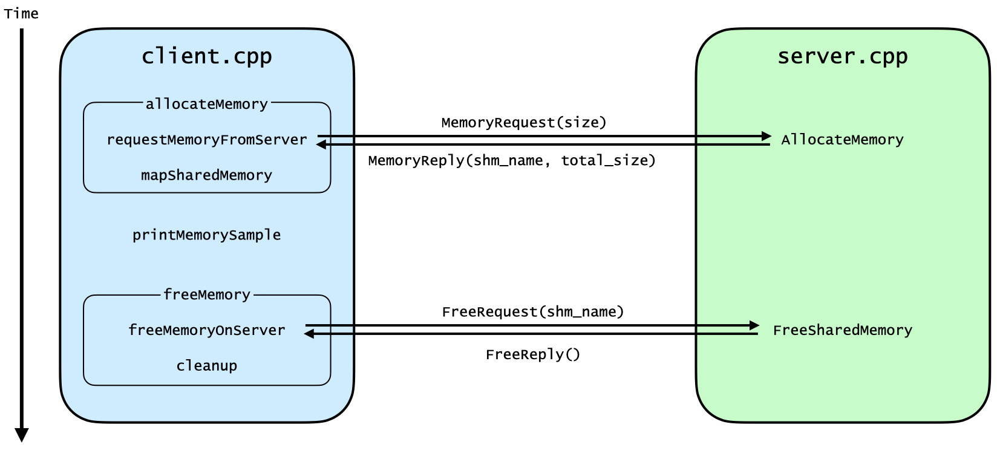
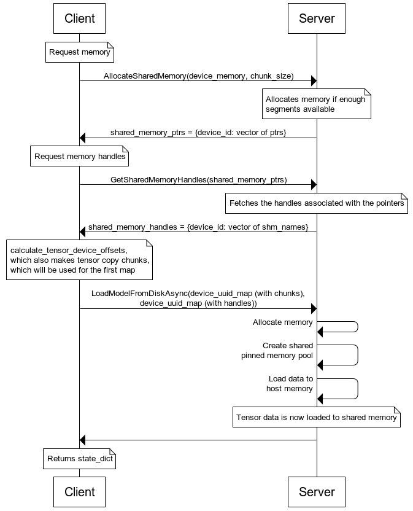

# ICSA Research Internship Blog

As large language models continue to grow, the challenge isn’t just how to train them, but how to store and serve them. Each checkpoint can span tens or even hundreds of gigabytes, spread throughout storage tiers. Bringing that data into memory efficiently, without wasting space or sacrificing consistency, is now one of the most important, and looked over, challenges in scaling AI systems.

## Introduction
As part of my Institute for Computing Systems Architecture (ICSA) internship, I developed and extended key components [ServerlessLLM’s](https://serverlessllm.github.io/docs/stable/intro) *sllm-store*, a Python library designed to provide fast, flexible checkpoint loading for large language models from multi-tier storage to GPU. 

My work focused on enhancing *sllm-store*'s usability and investigating a shared memory pool architecture for use by offloading-enabled applications. Specifically, I:

- Expanded the sllm-store CLI to enable saving and loading models directly from the terminal
- Built and benchmarked memory demos integrating CUDA, gRPC and POSIX shared memory to validate viability of the shared pinned memory architecture.
- Contributed to development of a shared pinned memory API for fast checkpoint loading to main memory by *sllm-store* to be made accessible to offloading-enabled applications which can run Mixture-of-Experts (MoE) inference

## [Extending the CLI for Better Usability](https://github.com/ServerlessLLM/ServerlessLLM/pull/272)
My first project was adding a backend-independent save and load commands to the *sllm-store* command-line interface. This allowed for this logic to be abstracted away from the user, which now could manage the models more intuitively than previously, which relied on example Python scripts.

With the new interface, the *sllm-store* CLI can now be used to launch the gRPC server (`start`), and `save` and `load` models through the higher-level API described in this blog [(ServerlessLLM Architecture Overview)](https://github.com/ServerlessLLM/ServerlessLLM/tree/main/blogs/serverless-llm-architecture#serverlessllm-store).

Now, the user can just run the same command with the parameters of choice, and the CLI will adapt to the different backends, increasing usability and improving developer experience.

For more information, access the documentation [here](https://serverlessllm.github.io/docs/api/sllm-store-cli/).

## [Exploring Shared Pinned Memory Through Demos](https://github.com/jpfbastos/memory-demos)
Afterwards, I produced some memory demos to familiarise myself with the shared pinned memory pool architecture and gRPC servers which would be used to communicate with the checkpoint manager on sllm-store.

I will explain the architecture of the final and most complete demo, but the code and more details about other demos can be found [here](https://github.com/jpfbastos/memory-demos)
### [Demo 5: Shared Pinned Memory Pool Architecture](https://github.com/jpfbastos/memory-demos/tree/main/demo5)
#### Overview
- Pre-allocates a large pool of page-locked (pinned) host memory on startup
- Registers this memory with CUDA for high-performance GPU transfers
- Exposes a gRPC API for clients to allocate and free shared memory segments, each mapped into client processes as needed
- Manages segmentation, allocation and cleanup of the memory pool

#### Why use a shared pinned memory pool?
By splitting the total memory into 4MB chunks, the client can have access to fine-grained allocation, while the server can reuse the CUDA-pinned buffers efficiently. The memory chunks are mapped to the shared memory region which is then shared with the client, so the client can use them in a unified way, but the chunks need not be contiguous.

#### Initialising memory pool

For each segment:

- Use `aligned_alloc` to get a page-aligned buffer of 4 MB
- Register with cuda by calling `cudaHostRegister` on the buffer. This pins the memory, and allows for DMA transfers between CPU and GPU
- Add buffer to the set of all segments (`pool_`) and a set of available segments (`free_list_`)

The diagram below shows the full lifecycle, from allocation to deallocation, as described in the following sections.

  

#### Memory allocation via gRPC (`AllocateMemory`)

This is the first step in the above figure, where the client sends a `MemoryRequest` containing the desired allocation size

Upon receiving a request:

- Round up the requested size to a multiple of the segment size (e.g., 10 MB → 3 segments of 4 MB)
- If there are enough free segments, create a POSIX shared memory object of the rounded size
- Map the shared memory into the server’s address space
- For each segment, use `MAP_FIXED` to map the buffer into the shared region

Now, those memory chunks are unified for those using the shared memory, and chunk metadata is stored for deallocation, in `segments_`.

The server sends a `MemoryReply` to the client with the shared memory name (which the client opens and maps) and the total size allocated, which may be different due to chunk size rounding.

#### Memory deallocation via gRPC (`FreeSharedMemory`)

This is the second step in the above figure, where the client sends a `FreeRequest` containing the shared memory name of the region to be freed.

Once the client requests deallocation, the server:

- Searches for the segment with the respective shared memory name in `segments_`
- If found, removes it and returns the buffer back to the list of free chunks, making it available for future allocations
- The segment’s destructor then handles:
  - unmapping the region
  - closing file descriptor
  - unlinking the shared memory

The server sneds a `FreeReply` to the client to confirm freeing the memory was a success.

This architecture demonstrates how to build a robust memory pool for GPU-enabled systems. By combining segmentation, CUDA registration, POSIX shared memory, and gRPC APIs, we achieve:

- Fast, scalable memory allocation
- Efficient sharing between processes
- Safe, flexible resource management
  
### Throughput experiments

`cudaHostRegister` is an expensive operation timewise, yet it allows for the faster transfer of data from CPU to GPU using DMA. To test which conditions are necessary for `cudaHostRegister` be beneficial, two experiments were made: one to measure the client CPU->GPU throughput with and without `cudaHostRegister` on the client side (with registration on the server side), and one which would analyse how `cudaHostRegister` time scales with data to be registered and with the data being registered on the server or not.

#### Copy Throughput
Every trial consisted of copying 10 GB of data once for warm-up and then copying it 10 times and calculating the average throughput, using [demo3a_client_throughput.cpp](https://github.com/jpfbastos/memory-demos/blob/main/demo3a_client_throughput.cpp). Each experiment consisted of 5 trials. All results are in GB/s.

**PCIe 4.0x8**
Setup
- NVIDIA GeForce RTX 4060 Ti
- 10 GB of data
- Expected Throughput - 12GB/s

Without `cudaHostRegister` on client (GB/s)

| 1       | 2       | 3       | 4       | 5       | Average |
|---------|---------|---------|---------|---------|---------|
| 11.6179 | 11.6207 | 11.6169 | 11.7031 | 11.6186 | 11.6354 |

With `cudaHostRegister` on client (GB/s)
| 1       | 2       | 3       | 4       | 5       | Average |
|---------|---------|---------|---------|---------|---------|
| 12.2628 | 12.2626 | 12.2688 | 12.3065 | 12.2879 | 12.2777 |

**PCIe 4.0x16**
Setup
- NVIDIA RTX A6000
- 10 GB of data
- Expected Throughput - 25GB/s

Without `cudaHostRegister` on client (GB/s)
| 1       | 2       | 3       | 4       | 5       | Average |
|---------|---------|---------|---------|---------|---------|
| 19.2520 | 18.9805 | 19.2792 | 18.4929 | 18.9492 | 18.9909 |

With `cudaHostRegister` on client (GB/s)
| 1       | 2       | 3       | 4       | 5       | Average |
|---------|---------|---------|---------|---------|---------|
| 23.0534 | 23.0480 | 23.0457 | 23.0430 | 23.0473 | 23.0475 |

So having `cudaHostRegister` on the client side as well is key to improve copy throughput. This is because each process has their CUDA context, and so even though it is pinned on the server’s side, the client’s CUDA context does not understand this, so it must be registered on the client as well. This is more noticeable in PCIe 4.0x16, where throughput increases by 21% (compared to the lesser 6% of PCIe 4.0x8)

The scaling factor is 1.88x instead of 2.0x from PCIe 4.0x8 to x16, but they still achieve 77% and 72% efficiency compared to their theoretical maximum respectively.

By including `cudaHostRegister` on the client’s side, we achieve high and consistent throughput. 

#### `cudaHostRegister` Time
This experiment aims to find out if performing `cudaHostRegister` on the server has any impact on the time taken to perform `cudaHostRegister` on the client. It also aims to find out if the time taken for `cudaHostRegister` to run is fixed or does it scale linearly with the amount of memory to be pinned?

I will run [demo3a_client_register_time.cpp](https://github.com/jpfbastos/memory-demos/blob/main/demo3a_client_register_time.cpp) 5 times per trial. Every experiment has 5 trials, with each trial having the server reinitialise. All units are in milliseconds (ms)

Setup
- NVIDIA RTX A6000

**`cudaHostRegister` time with 10GB**
Without `cudaHostRegister` on the server (ms)
| Run     | Trial 1  | Trial 2  | Trial 3  | Trial 4  | Trial 5  | Average  |
|---------|-----------|-----------|-----------|-----------|-----------|-----------|
| **1**   | 824.644   | 873.534   | 854.219   | 810.727   | 799.229   | 832.471   |
| **2**   | 804.205   | 827.267   | 817.929   | 849.119   | 800.323   | 819.769   |
| **3**   | 845.281   | 804.161   | 812.763   | 827.601   | 808.256   | 819.612   |
| **4**   | 807.862   | 858.774   | 842.639   | 814.571   | 826.661   | 830.101   |
| **5**   | 822.835   | 811.677   | 809.254   | 861.690   | 830.371   | 827.165   |
| **Average across trials** | **825.824** |           |           |           |           |           |

With `cudaHostRegister` on the server (ms)
| Run     | Trial 1  | Trial 2  | Trial 3  | Trial 4  | Trial 5  | Average  |
|---------|-----------|-----------|-----------|-----------|-----------|-----------|
| **1**   | 792.842   | 899.233   | 807.337   | 813.381   | 797.074   | 821.973   |
| **2**   | 801.978   | 819.880   | 803.686   | 838.758   | 814.794   | 815.819   |
| **3**   | 803.758   | 865.228   | 831.698   | 797.937   | 832.230   | 826.170   |
| **4**   | 810.371   | 796.142   | 803.558   | 835.628   | 831.474   | 815.435   |
| **5**   | 795.123   | 872.509   | 847.580   | 790.600   | 803.613   | 821.885   |
| **Average across trials** | **820.256** |           |           |           |           |           |

We can see that running `cudaHostRegister` on the server side has a negligible impact (~5ms, ~0.7%) on the speed of running `cudaHostRegister` on the client.

**`cudaHostRegister` time with 40GB**
Each experiment has 3 trials, with 5 runs per trial. Server reinitialises each trial

Without `cudaHostRegister` on the server (ms)
| Trial      | Run 1   | Run 2   | Run 3   | Run 4   | Run 5   | Average  |
|------------|----------|----------|----------|----------|----------|----------|
| **1**      | 3377.18  | 3347.89  | 3321.97  | 3298.26  | 3318.92  | 3332.84  |
| **2**      | 3402.31  | 3339.11  | 3307.08  | 3340.78  | 3385.30  | 3354.92  |
| **3**      | 3446.40  | 3387.32  | 3339.38  | 3367.62  | 3355.49  | 3379.24  |
| **Average across trials** | **3355.67** |          |          |          |          |          |

With `cudaHostRegister` on the server (ms)
| Trial      | Run 1   | Run 2   | Run 3   | Run 4   | Run 5   | Average   |
|------------|----------|----------|----------|----------|----------|-----------|
| **1**      | 3258.33  | 3262.36  | 3200.40  | 3186.36  | 3210.12  | 3223.51   |
| **2**      | 3281.64  | 3252.68  | 3249.01  | 3294.98  | 3271.58  | 3269.978  |
| **3**      | 3304.88  | 3246.73  | 3253.69  | 3257.54  | 3288.55  | 3270.278  |
| **Average across trials** | **3254.59** |          |          |          |          |           |

Difference between them is 100ms (3% improvement)

As we can also see, the time it takes to run cudaHostRegister` increases linearly, as we increased the size of the data by 4x (from 10GB to 40GB) and the time it took scaled by around that factor too (3355.67/825.824 = 4.06x and 3254.59/820.256 = 3.97x)

By taking the case with the biggest latency, we can expect the registration latency to be 3355.67/40 = 83.9ms/GB (0.0839s/GB) registered.

By taking the reciprocal of the throughput, we can calculate copy latency being 1/23.0475 = 0.0434s/GB and 0.0527s/GB for unregistered data. Therefore, the CPU->GPU (and vice versa) **total copy volume needs to be 9.05 times the registered amount** for the 0.0839s/GB registration time to be amortised.

## [Developing the Shared Memory API](https://github.com/ServerlessLLM/ServerlessLLM/pull/295)
Finally, I worked on a shared memory API which would allow *sllm-store* to load tensor data into a shared pinned memory pool to be able to be accessed by external programs. This could then, in the future, be used to communicate with offloading-enabled applications which can benefit from *sllm-store*’s fast checkpoint loading, even if the inference is then done by the application itself.

When using the `sllm-store start` on the CLI, there is a boolean parameter called `use_shm`, which indicates if `CheckpointStore` will be initialised with a shared pinned memory pool or an aligned pinned memory pool.

The following outlines the main events when load is called with the server on `use_shm`:

### 1. Loading the model and allocating shared memory
On load, `transformers.py` calls `load_dict_shm` from `torch.py`. From there, `checkpoint_store.cpp` allocates shared memory in chunks. It calculates the number of chunks by rounding up the size necessary divided by the chunk size. Then it opens shared memory files if they have been previously used, or creates new ones, and maps and registers that data in host memory. When a new shared memory file is created, it is registered in the `MemoryRegistry`, which tracks all shared memory chunks for access and cleanup.

### 2. Producing the shared pinned memory pool
Pointers to these chunks are returned, and are then converted into shared memory handles, which are the names of the file the pointers point to. These are used when loading the model to shared memory, done by calling `LoadModelAsync`, which uses `checkpoint_store.cpp`’s `LoadModelFromDisk` function. `LoadModelFromDisk`, after converting the chunks to be copied and the handles from uuid based maps to device id based maps, produces the shared pinned memory pool by opening the shared memory chunks created previously, and calls ToHost to copy the data to that shared memory pool.

### 3. Accessing tensors in shared memory
Now that we have the tensors in shared memory, it can be accessed by other applications. This is beneficial as it uses sllm-store’s fast loading, yet allows for inference made by other programs. However, to finish off the example I’ll work in the context of *sllm-store*.

We can restore tensors from `torch.py` using the function in `checkpoint.cpp`, which allows us to return the `state_dict`. In PyTorch, the `state_dict` is what maps each layer to the parameter tensor, so will contain the information necessary to run our model.

Once the model is returned, we can run inference on it.

  

This is the architecture which would allow for a shared memory API to be implemented for *sllm-store* to be able to load tensor data in a way where different programs can then run inference on it.

## Conclusion and Future Work
This internship gave me the opportunity to work with the systems that power LLM serving and to understand what happens under the hood in a serving system, tackling both practical usability challenges and architectural problems.

Through extending the CLI, building memory demos, and implementing a shared memory API, this work gave me hands-on experience with CUDA, pinned memory, shared memory design, and gRPC-based communication, while also contributing useful features to *sllm-store*. This project not only deepened my understanding of memory systems and serverless inference architectures, but also gave me the chance to contribute to an active open-source research codebase.

Looking ahead, the shared memory API, once finalised, opens the door for broader integrations, enabling external inference applications to harness ServerlessLLM’s fast checkpoint loading to accelerate their own workflows.

I would like to thank [Dr. Luo Mai](https://luomai.github.io/) for the opportunity and mentorship throughout the internship, [Yao Fu](https://future-xy.github.io/) for his invaluable technical guidance and leadership, and [Leyang Xue](https://drunkcoding.github.io/) for his insights and collaboration on the shared pinned memory implementation.
